# Comentários sobre o livro `Software Engineering at Google` - Cauã Cursino 2° ADS :shipit:

## Exercício 1) Trecho 1
> What precisely do we mean by software engineering? What distinguishes “software engineering” from “programming” or “computer science”? And why would Google have a unique perspective to add to the corpus of previous software engineering literature written over the past 50 years? The terms “programming” and “software engineering” have been used interchangeably for quite some time in our industry, although each term has a different emphasis and different implications. University students tend to study computer science and get jobs writing code as “programmers.” “Software engineering,” however, sounds more serious, as if it implies the application of some theoretical knowledge to build something real and precise. Mechanical engineers, civil engineers, aeronautical engineers, and those in other engineering disciplines all practice engineering. They all work in the real world and use the application of their theoretical knowledge to create something real. Software engineers also create “something real,” though it is less tangible than the things other engineers create. Unlike those more established engineering professions, current software engineering theory or practice is not nearly as rigorous. Aeronautical engineers must follow rigid guidelines and practices, because errors in their calculations can cause real damage; programming, on the whole, has traditionally not followed such rigorous practices. But, as software becomes more integrated into our lives, we must adopt and rely on more rigorous engineering methods. We hope this book helps others see a path toward more reliable software practices.

**Comentário:** O texto aborda uma dúvida “o que diferencia engenharia de software de programação ou ciência da computação?”. Os termos “programação” e “engenharia de software” tem sido usados para poupar tempo, mas cada um tem diferentes significados. Os alunos quando estudam ciência da computação tendem a trabalharem como programadores. Ja a área de engenharia de software soa mais séria. Todas as engenharias - civil, mecânica e etc. - usam seus conhecimentos teóricos para criar algo real no mundo real. 
Engenheiros de software também criam “coisas reais”, porém `menos tangíveis` (ou até mesmo, `intagíveis`) que as outras. Diferentemente das demais engenharias, a engenharia de software não é tão rigorosa e não apresenta riscos de danos reais. Porém, quanto mais integramos integramos softwares em nossas vidas, devemos confiar nos métodos mais rigorosos da engenharia. 

 
 

## Exercício 2) Trecho 2
> We propose that “software engineering” encompasses not just the act of writing code, but all of the tools and processes an organization uses to build and maintain that code over time. What practices can a software organization introduce that will best keep its code valuable over the long term? How can engineers make a codebase more sustainable and the software engineering discipline itself more rigorous? We don’t have fundamental answers to these questions, but we hope that Google’s collective experience over the past two decades illuminates possible paths toward finding those answers. One key insight we share in this book is that software engineering can be thought of as “programming integrated over time.” What practices can we introduce to our code to make it sustainable—able to react to necessary change—over its life cycle, from conception to introduction to maintenance to deprecation?
> The book emphasizes three fundamental principles that we feel software organizations should keep in mind when designing, architecting, and writing their code:
> Time and Change
> How code will need to adapt over the length of its life
> Scale and Growth
> How an organization will need to adapt as it evolves
> Trade-offs and Costs
> How an organization makes decisions, based on the lessons of Time and Change and Scale and Growth

**Comentário:** Engenharia de software não engloba apenas o ato de escrever códigos, mas todas as ferramentas e processos que uma organização precisa para manter um projeto. O verdadeiro valor da engenharia de software está na sustentabilidade do código ao longo de sua vida útil. Isso implica não só boas práticas técnicas (como testes, revisões de código e arquitetura sólida), mas também práticas organizacionais que permitam adaptação e aprendizado contínuos. Além disso, é importante durante o desenvolvimento se atentar à `escalabilidade` do produto, ou seja, o quanto o produto/ software será utilizado. Dessa forma, é possível prever a quantidade de usuários e gerenciar para que o software suporte essa quantidade ao mesmo tempo que é mais difundido.

 
 

## Exercício 3) Exemplos de Trade-Off

* Um exemplo de trade-off é o `custo e qualidade`. Muitas empresas precisam decidir se investem mais para oferecer um produto de alta qualidade ou reduzem gastos para torná-lo mais acessível. Melhorar a qualidade pode aumentar a satisfação do cliente, mas também eleva o preço final, afastando parte do público.

* Outro caso comum é o `tempo e precisão`. Em projetos com prazos curtos, a equipe pode acelerar as entregas, o que geralmente reduz a profundidade da análise ou o cuidado nos detalhes. Cumprir o prazo garante a entrega rápida, mas pode comprometer a confiabilidade do resultado.

* Um terceiro exemplo é o `flexibilidade e eficiência`. Processos muito flexíveis permitem diversas adaptações e personalizações, atendendo diferentes necessidades, mas essa característica pode tornar o trabalho mais lento e custoso. Já um processo altamente eficiente é rápido e econômico, mas menos adaptável a mudanças.

 
 

## Exercício 4) Diagrama de classes UML
Abaixo, se encontra o diagrama de classes do projeto `Mercado`:

 
 

## Exercício 5) Código JAVA
Abaixo, se encontram os códigos referentes ao diagrama de classes do projeto `Mercado`:

`Classe Mercado`

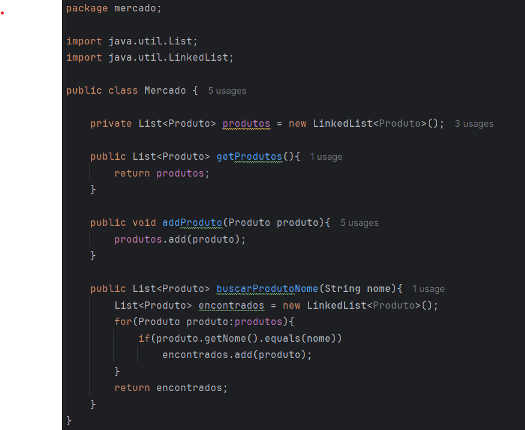

`Classe Produto`

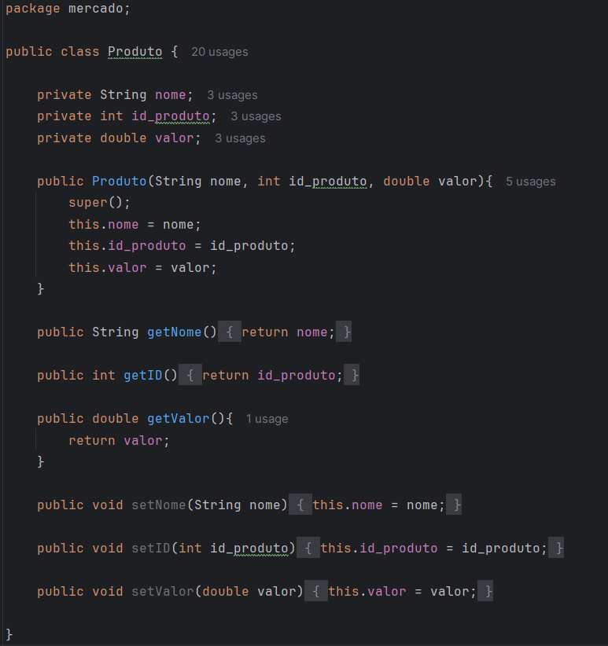

`Classe Compra`

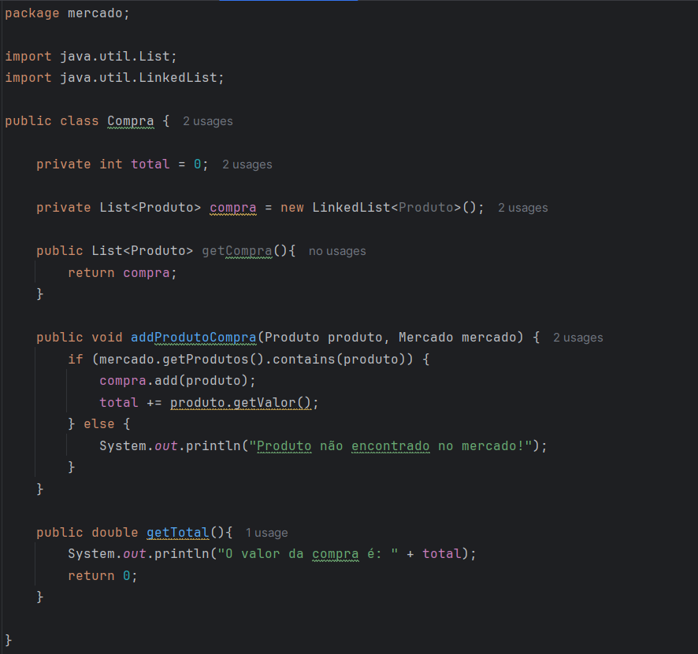

> [!IMPORTANT]
> Correção: O atributo "total" deve estar em 'double' ao invés de 'int',
> já que o método que retorna o valor está em 'double'

 
 

## Exercício 6) Testes automátizados
Abaixo, se encontram testes referentes aos códigos do projeto `Mercado`:

`Teste 1`

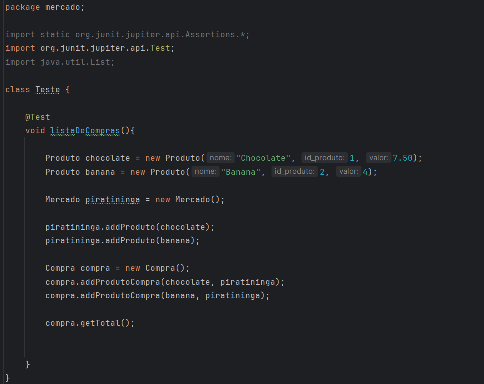

`Teste 2`

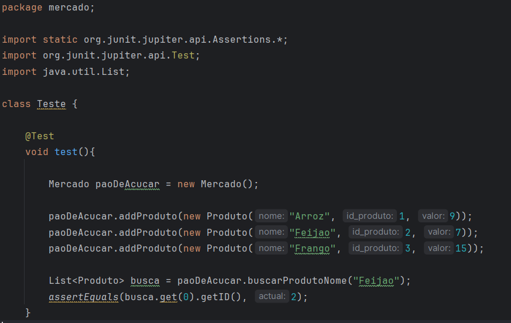

> [!IMPORTANT]
> Seguem os resultados dos testes:

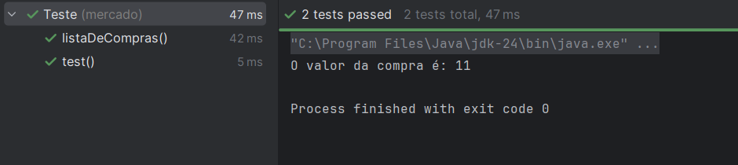

 
 

## Exercício 7) Diagrama de classes UML
Abaixo, se encontra o diagrama de classes do projeto `Companhia`:

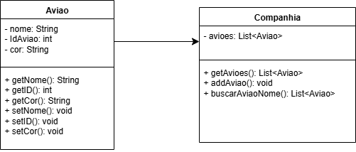

 
 

## Exercício 8) Código JAVA
Abaixo, se encontram os códigos referentes ao diagrama de classes do projeto `Companhia`:

`Classe Companhia`

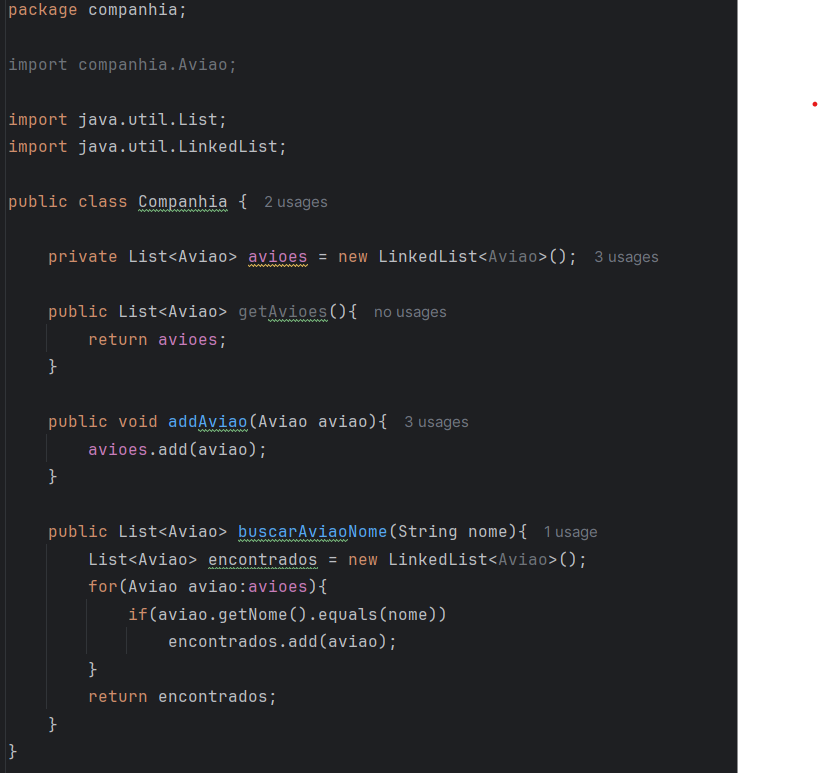

`Classe Aviao`

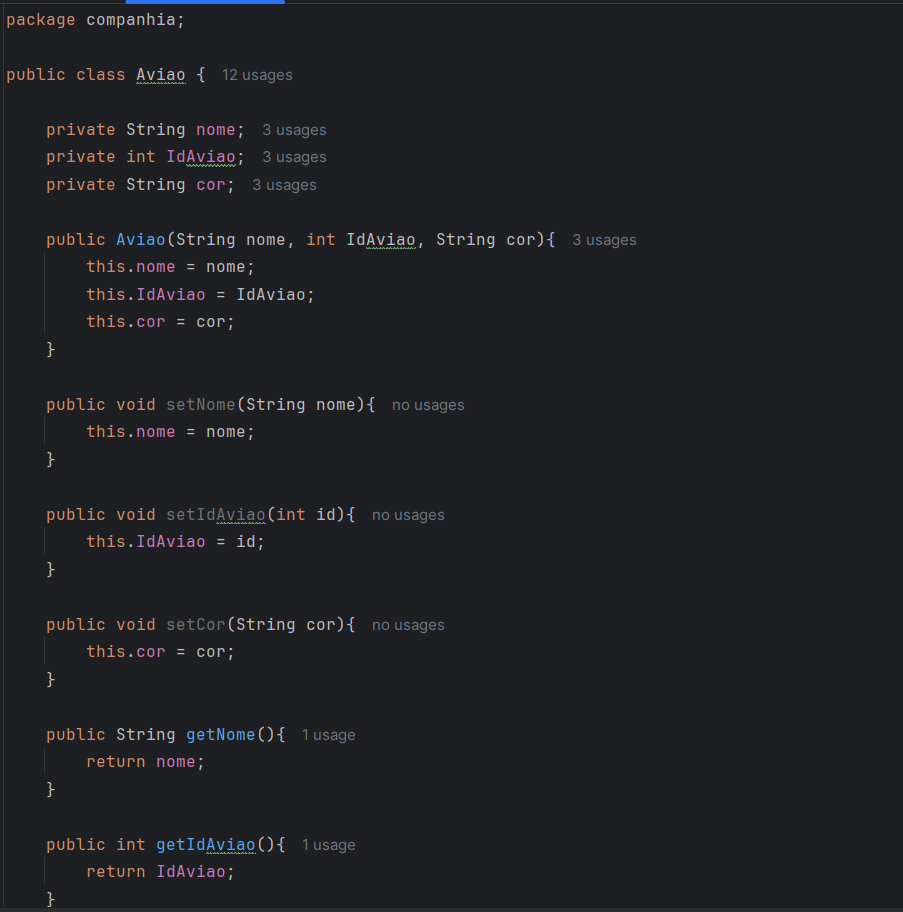

 
 

## Exercício 9) Testes automátizados
Abaixo, se encontram testes referentes aos códigos do projeto `Companhia`:

`Teste 1`

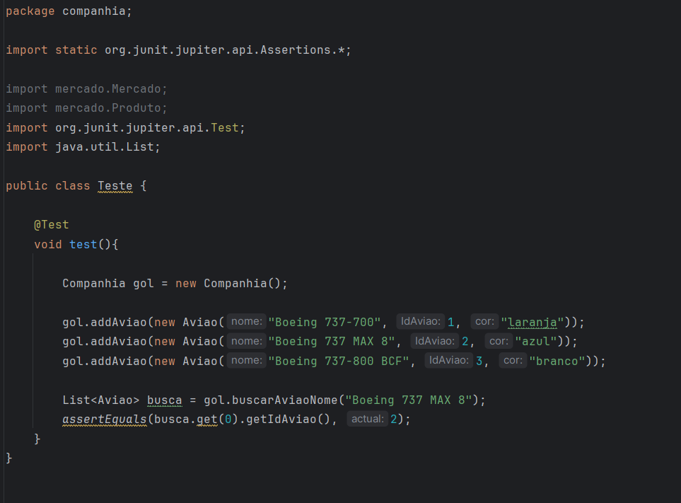

> [!IMPORTANT]
> Seguem os resultados dos testes:

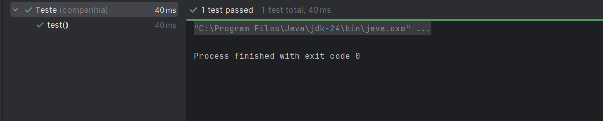

